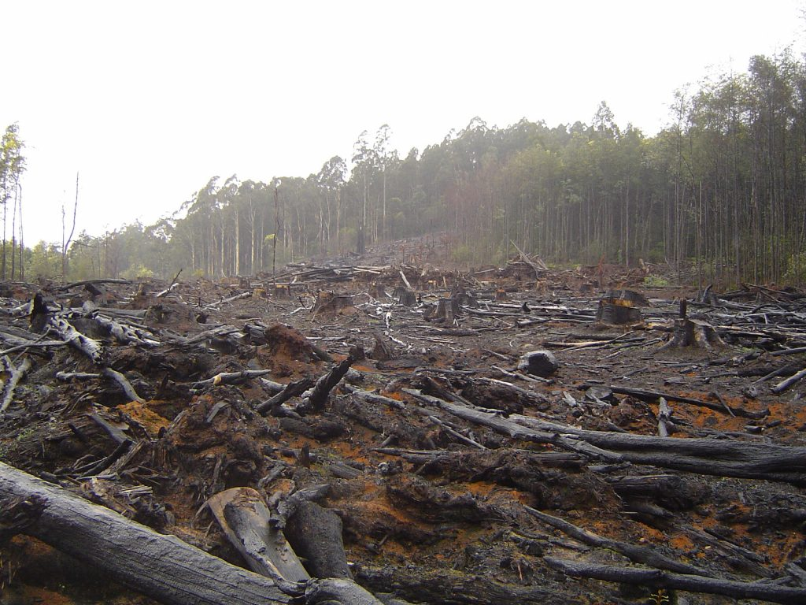

Capitalism is a term given when the social, political and economic systems of a country are controlled by private owners instead of the state. When private owners are in control, they enjoy the benefits and profits all by themselves, as opposed to when the state is in control. When the state is in control, the benefits are shared. Capitalism is the ultimate by-product of individualism, greed, selfishness and materialism.

Karl Marx, who was unashamedly against capitalism, said that capitalism brought about rapid and very vast economic growth in a country, only that the benefits from that growth are only enjoyed by the minority, who exploit the unsuspecting majority.

Capitalism has brought economic instability. The wealth has constantly become concentrated in the hands of the few but powerful individuals. They continue to become wealthier, and the poor continue to be exploited and end up languishing in constant poverty.

Capitalism has also led to the exploitation of national resources. Every year when the national budget is prepared, there’s allocation of funds to different sectors of the economy throughout the country. Most of these allocations are for development purposes. Years later, no development is documented, and yet the government disbursed the funds. So where does this money go to? To the pockets and projects of a few individuals.

Through advertising, marketing and entertainment, capitalism has turned people into consumers instead of them being empowered to be business owners and investors. People have been turned into tools of manipulations because the more they spend on buying the commodities and services, the more money the big fish swallows.

When it comes to elections, capitalism is used to brainwash and blindfold the voters. It is usually these big and rich people that dominate the elections. Instead of people voting for the candidates that have their best interest at heart, the electorates are lured into voting for the rich candidates. Once they resume office, they only protect their own personal interests. And it’s always like that until the next election and the cycle continues.

Capitalism has led to the destruction of any rival economic system, mainly through cartels. Any individual, activists and organizations that tries to seek for system reforms, they are destroyed to an extent of some losing their lives. For the fear of being killed physically, socially or economically, these people are left with no choice but to keep mum and just like the rest of us, watch the country as it self-destructs.

In conclusion, capitalism is the modern day cancer that is slowly and silently killing nations. Our food is making us fat and ill because it’s more important to make a profit than a quality product, our air has been polluted; we are literally breathing in poison, our land has become barren; it can no longer bear to full potential, our oceans have been destroyed; every sort of waste has found its easy way there, our trees have been cut down; we can no longer have sufficient rain to quench our dry lands and this list could go on and on. Question is, will capitalism ever surrender?