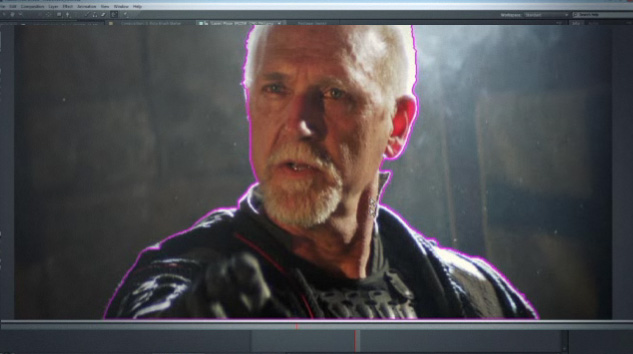

With the recent release of the 40 minute video from Adobe promoting their fifth incarnation of their Creative Suite software, we compile the greatest features on offer to web designers and developers.

<!-- end -->

## Anticipation of launch

Today saw the long awaited launch of Adobe’s fifth incarnation of its Creative Suite software. New releases from Adobe are often highly anticipated events. Indeed this year I found myself watching the ‘countdown to launch’ timer for almost 25 minutes.

In the past I have found myself underwhelmed with some of the releases. Most notably; Creative Suite 4, which - for me - added very little in terms of functionality. CS5 – it appears – is an _essential_ upgrade.

If you wish to watch the full video yourself, it is available here: [http://cs5launch.adobe.com/](http://cs5launch.adobe.com/) the webcast only played the first 40 minutes but the full version is 60 minutes as it also includes a preview for the included ‘Omniture’ program, which seems to be amazing for people who are interested in performance tracking.

## First impressions

I already knew about CS5’s amazing new ‘content-aware fill’ but it seemed so amazing (and coupled with the fact it was first shown on April 1st) that I found it very hard to believe.  Today its existence was not only confirmed but also showed a great deal more amazing features which made me thankful I was not drinking a cup of coffee at my PC, or  I would have ended up with a very wet screen.

## Rundown of features

Let’s start with everyone’s favourite package in the Creative Suite.

### Photoshop

Photoshop by far received the most updates and is definitely the thing to be the most excited about. Two of the stand-out features are:

**Content-Aware Fill** – This is the most exciting part of this year’s release. Its downside is the fact that a _lot_ of people have long based their jobs around the ability to remove detail from a photograph whilst seemingly leaving the background intact. Whilst these people will still be required for the very complex jobs, Photoshop will now happily do most of the work for them. In fact for _most_ images, it will replace them entirely.

In terms of how it works. I really can only recommend watching the [video example](http://www.youtube.com/watch?v=NH0aEp1oDOI "Youtube Video of what Content Aware Fill can do."); it seems nothing short of witchcraft.

**Smart Selection tools** – One of the most annoying parts of image manipulation (and again the focus of many a job) is masking, the process of removing an object from its background. This has always been a difficult job for anything with a complex background, especially if that subject had hair or fur. If the example on the video is to be believed this is now as simple as a few clicks of the mouse and takes only seconds.

### Dreamweaver

Dreamweaver gets a worryingly short mention. In fact it felt like the entire web-premium section was shorter than the others. That’s not to suggest it is feature-free though:

**Enhanced Live view** – Dreamweaver can now display your dynamic web page within the application as if it was already live on the server. This appears to work really well and will certainly make site development and testing a hell of a lot easier. **Browser Lab –** A major point of annoyance for all (conscientious) web developers is that in order to be able to test your website in other browsers you need to have them installed. This is fine for the most part but testing in Macintosh Safari or previous versions of IE can often require access to another machine. Browser lab can apparently render perfect examples of what the site will look like from within its own standalone application. It even allows side-by-side comparisons and onion-skinning.

### Flash

**Flash Catalyst** – I’ve never been a fan of developing in Flash, it’s awkward and I did not want to have to learn ActionScript. Flash Catalyst will take your designs from your Illustrator, InDesign or even Photoshop and automatically convert it into a flash animation. Everything else is preset actions and drag-and-drop. **Element**\-**element text flow –** One of the parts about Flash I hated the most was how when you import text into a layout and that text is split across elements. Editing it at a later date can be a nightmare as you inevitably have to refit all the text to the other elements.  It is now possible to link the elements together and the text will smoothly flow between them. **Automatic iPhone app creation** – I must confess, this is something you will need to read into as I cannot guarantee this information is 100% accurate. The video implies it is now possible to automatically convert ANY Flash application into a native iPhone app and automatically submit it for inclusion into the Apple App Store.

### Premiere Pro and After Effects

I know video editing is not part of the Web Suite but these days being able to edit video for the web is definitely a good skill to have.

**Automatic Rotoscoping** – This feature blew my mind; rotoscoping has always been a difficulty, even when against a chroma-key (green/blue screen) background it can be difficult. Premiere CS5 allows you to create a rough selection in one frame, it will then use the smart selection tools to automatically find the outline and mask it on that frame. Sounds good yeah? If you then advance to the next frame ready to do it again, you’d find that Premiere has already done it for you. That’s right, manual rotoscoping is history.

**Mercury Playback Engine** – This is a 64Bit only feature but the benefit of this is that the more RAM you have the more you can use premiere in real-time. Even more amazingly, if you have an NVidia GPU (Not sure about other manufacturers yet). Your GPU itself will be utilised to allow for on-the-fly editing and composition. You can make changes to the video whilst it is playing. The example here shows the result of the above rotoscoping on live playback:

### Business Catalyst

To be honest this feature is more of a worry to me than an excitement - I have seen companies create ‘web building’ applications before and they nearly always result in a poorly made site, simply put; software has not yet developed the ability to think creatively and until it does there is no substitute for a real web designer. Watching it at work however is amazing, it seems to give people who do not have the ability to program code to build rich, dynamic applications. Again I’m not sure this is a particularly good thing as I am concerned that it will increase the opinion that ‘anyone can be a web designer’. However once I get my hands on the product and am able to have a play myself I will try to give a balanced review.

## My opinion

I do not think I have been more excited about an Adobe release since the introduction of the Effects panel back in the late 90’s. This is a must-have upgrade for any current users.

One of the things I have not really mentioned in this review is the ‘live services’ feature, this includes features such as live technology trending data (including browser popularity), instant collaboration and online creative feedback which integrates within the suite’s applications.

As soon as I am able to get my hands on the suite I will post a more comprehensive review.

_Disclaimer: All of the images utilised in this article are taken from the Adobe website. This review is based on the repeated viewing of the 60 minute CS5 presentation._
